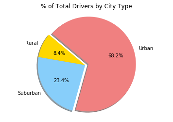

#Analysis

    1. The urban city type has the most drivers
    2. Most rides have low average fares which could be an indicator of short trip durations
    3. Suburban and urban city types have similar average fares


```python
import matplotlib.pyplot as plt
import numpy as np
import pandas as pd
```


```python
city_df = pd.read_csv("raw_data/city_data.csv")
city_df.head()
```


<div>
<style scoped>
    .dataframe tbody tr th:only-of-type {
        vertical-align: middle;
    }

    .dataframe tbody tr th {
        vertical-align: top;
    }

    .dataframe thead th {
        text-align: right;
    }
</style>
<table border="1" class="dataframe">
  <thead>
    <tr style="text-align: right;">
      <th></th>
      <th>city</th>
      <th>driver_count</th>
      <th>type</th>
    </tr>
  </thead>
  <tbody>
    <tr>
      <th>0</th>
      <td>Richardfort</td>
      <td>38</td>
      <td>Urban</td>
    </tr>
    <tr>
      <th>1</th>
      <td>Williamsstad</td>
      <td>59</td>
      <td>Urban</td>
    </tr>
    <tr>
      <th>2</th>
      <td>Port Angela</td>
      <td>67</td>
      <td>Urban</td>
    </tr>
    <tr>
      <th>3</th>
      <td>Rodneyfort</td>
      <td>34</td>
      <td>Urban</td>
    </tr>
    <tr>
      <th>4</th>
      <td>West Robert</td>
      <td>39</td>
      <td>Urban</td>
    </tr>
  </tbody>
</table>
</div>


```python
ride_df = pd.read_csv("raw_data/ride_data.csv")
ride_df.head()
```


<div>
<style scoped>
    .dataframe tbody tr th:only-of-type {
        vertical-align: middle;
    }

    .dataframe tbody tr th {
        vertical-align: top;
    }

    .dataframe thead th {
        text-align: right;
    }
</style>
<table border="1" class="dataframe">
  <thead>
    <tr style="text-align: right;">
      <th></th>
      <th>city</th>
      <th>date</th>
      <th>fare</th>
      <th>ride_id</th>
    </tr>
  </thead>
  <tbody>
    <tr>
      <th>0</th>
      <td>Lake Jonathanshire</td>
      <td>2018-01-14 10:14:22</td>
      <td>13.83</td>
      <td>5739410935873</td>
    </tr>
    <tr>
      <th>1</th>
      <td>South Michelleport</td>
      <td>2018-03-04 18:24:09</td>
      <td>30.24</td>
      <td>2343912425577</td>
    </tr>
    <tr>
      <th>2</th>
      <td>Port Samanthamouth</td>
      <td>2018-02-24 04:29:00</td>
      <td>33.44</td>
      <td>2005065760003</td>
    </tr>
    <tr>
      <th>3</th>
      <td>Rodneyfort</td>
      <td>2018-02-10 23:22:03</td>
      <td>23.44</td>
      <td>5149245426178</td>
    </tr>
    <tr>
      <th>4</th>
      <td>South Jack</td>
      <td>2018-03-06 04:28:35</td>
      <td>34.58</td>
      <td>3908451377344</td>
    </tr>
  </tbody>
</table>
</div>


```python
combo_df = ride_df.merge(city_df, on=['city'])
combo_df.head()
```


<div>
<style scoped>
    .dataframe tbody tr th:only-of-type {
        vertical-align: middle;
    }

    .dataframe tbody tr th {
        vertical-align: top;
    }

    .dataframe thead th {
        text-align: right;
    }
</style>
<table border="1" class="dataframe">
  <thead>
    <tr style="text-align: right;">
      <th></th>
      <th>city</th>
      <th>date</th>
      <th>fare</th>
      <th>ride_id</th>
      <th>driver_count</th>
      <th>type</th>
    </tr>
  </thead>
  <tbody>
    <tr>
      <th>0</th>
      <td>Lake Jonathanshire</td>
      <td>2018-01-14 10:14:22</td>
      <td>13.83</td>
      <td>5739410935873</td>
      <td>5</td>
      <td>Urban</td>
    </tr>
    <tr>
      <th>1</th>
      <td>Lake Jonathanshire</td>
      <td>2018-04-07 20:51:11</td>
      <td>31.25</td>
      <td>4441251834598</td>
      <td>5</td>
      <td>Urban</td>
    </tr>
    <tr>
      <th>2</th>
      <td>Lake Jonathanshire</td>
      <td>2018-03-09 23:45:55</td>
      <td>19.89</td>
      <td>2389495660448</td>
      <td>5</td>
      <td>Urban</td>
    </tr>
    <tr>
      <th>3</th>
      <td>Lake Jonathanshire</td>
      <td>2018-04-07 18:09:21</td>
      <td>24.28</td>
      <td>7796805191168</td>
      <td>5</td>
      <td>Urban</td>
    </tr>
    <tr>
      <th>4</th>
      <td>Lake Jonathanshire</td>
      <td>2018-01-02 14:14:50</td>
      <td>13.89</td>
      <td>424254840012</td>
      <td>5</td>
      <td>Urban</td>
    </tr>
  </tbody>
</table>
</div>


```python
grp_combo_df = combo_df.groupby(['city'])
avg_fares = grp_combo_df['fare'].mean()
total_rides = grp_combo_df['ride_id'].count()
num_drivers = grp_combo_df['driver_count'].max()
city_types = combo_df['type'].unique()

```


```python

colors = ['Gold','LightSkyBlue','LightCoral']

plt.scatter(total_rides, avg_fares,s=(num_drivers*3), c=colors, linewidths=1, edgecolor='black')
plt.title("Pyber Ride Sharing Data (2018)")
plt.xlabel("Total Number of Rides (Per City)")
plt.ylabel("Average Fare ($)")
legend = ('Rural','Suburban','Urban')
plt.legend(legend)
plt.show()
```


```python
#Total Fares by City Type
grp_types_df = combo_df.groupby(['type'])
total_fares = grp_types_df['fare'].sum()

labels = ['Rural','Suburban','Urban']

colors = ['Gold','LightSkyBlue','LightCoral']

explode = (0, 0, 0.075)


plt.title("% of Total Fares by City Type")
plt.pie(total_fares, explode=explode, labels=labels, colors=colors,
        autopct="%1.1f%%", shadow=True, startangle=140)
plt.axis("equal")
plt.show()
```


```python
#Total Rides by City Type
total_rides = grp_types_df['ride_id'].count()

labels = ['Rural','Suburban','Urban']

colors = ['Gold','LightSkyBlue','LightCoral']

explode = (0, 0, 0.075)


plt.title("% of Total Rides by City Type")
plt.pie(total_rides, explode=explode, labels=labels, colors=colors,
        autopct="%1.1f%%", shadow=True, startangle=140)
plt.axis("equal")
plt.show()
```


```python
#Total Drivers by City Type
total_drivers = grp_types_df['driver_count'].max()

labels = ['Rural','Suburban','Urban']

colors = ['Gold','LightSkyBlue','LightCoral']

explode = (0, 0, 0.075)


plt.title("% of Total Drivers by City Type")
plt.pie(total_drivers, explode=explode, labels=labels, colors=colors,
        autopct="%1.1f%%", shadow=True, startangle=140)
plt.axis("equal")
plt.show()
```




